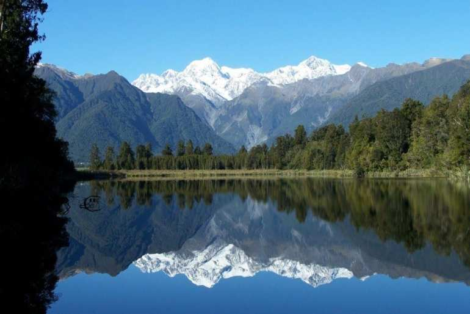
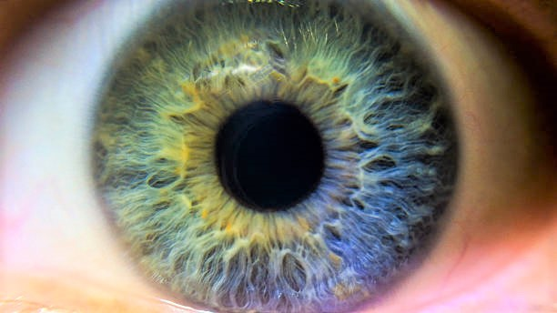
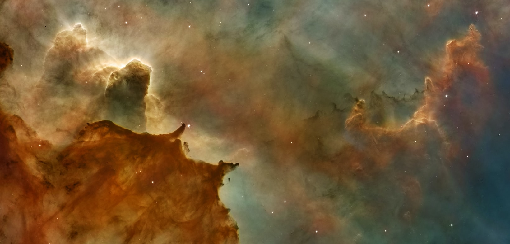
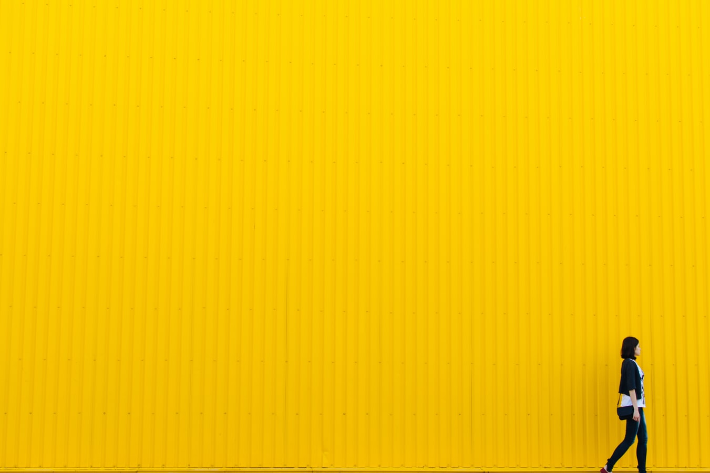
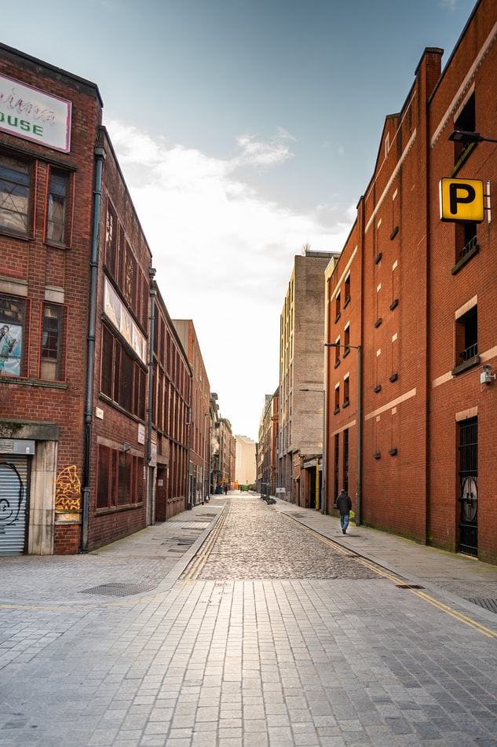

# Image-Process

# Project 1:
make the image sharper with laplacian, without OpenCv library.  
the project also refer to the padding of the image.
the process in grey levels.
* Examles:

* result:

# Project 2:
morphing function beetwin 2 images, without OpenCv library.  
after the morphing functions, images process of the result.
the process in grey levels.

* Examles:

* result:

* Examles:

* result:

# final project:

* This system runs an algorithm for identifying flowers in a test image based on positive and negative patterns, based on pre-processing, both on the experiment image and on the template database. 

* Examles for templates, before and after process:

* Examles for test image, before and after process:

* After processing the images, the system transfers the data to the function for finding the patterns on the free image.
* if the 'treshold' is in range and also the image is not in the area of the negative patterns, the system will mark the pattern identified on the image.
* with OpenCv library but without 'haar cascade' algorithm.
* Examles for results:

